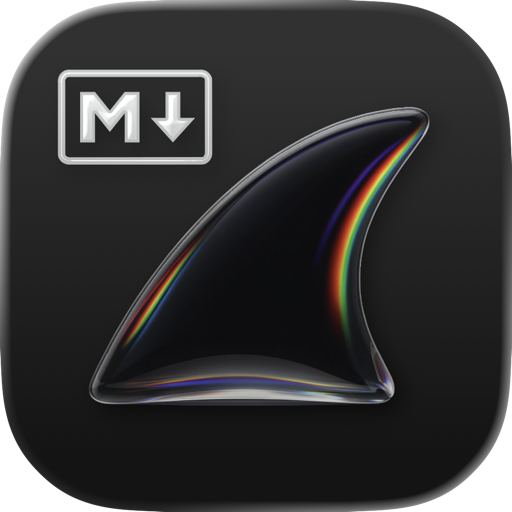
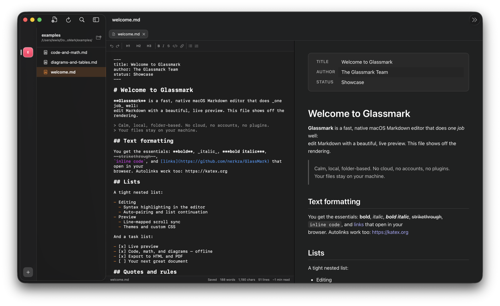
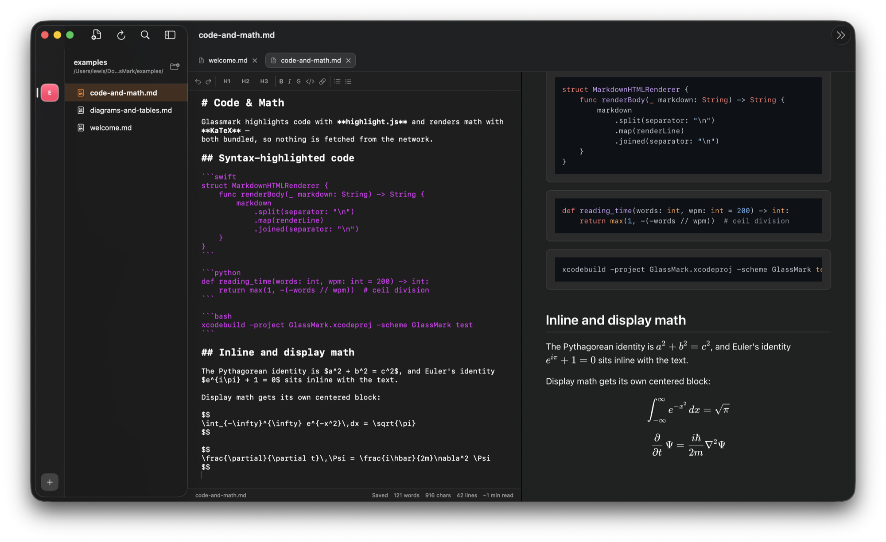
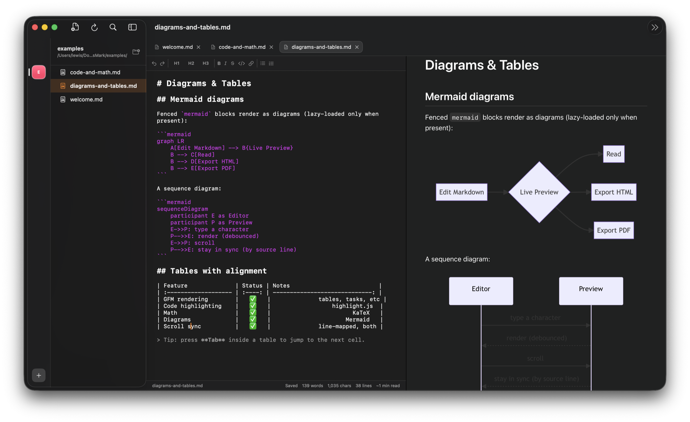

<p align="center">
  
</p>

<h1 align="center">Glassmark</h1>

<p align="center">
  <strong>A fast, native macOS Markdown editor that does one thing well.</strong>
</p>

<p align="center">
  Edit Markdown with a beautiful live preview — calm, local, folder-based.<br/>
  No cloud, no accounts, no plugins. Your files stay on your machine.
</p>

<p align="center">
  
  
  
  
  
  <a href="LICENSE"></a>
  <a href="https://github.com/nerkza/GlassMark/stargazers"></a>
</p>

<p align="center">
  <a href="#features">Features</a> ·
  <a href="#installation">Installation</a> ·
  <a href="#keyboard-shortcuts">Shortcuts</a> ·
  <a href="#building-from-source">Build</a> ·
  <a href="https://github.com/nerkza/GlassMark/issues">Report a bug</a>
</p>

<p align="center">
  
</p>

<p align="center">
  
</p>

---

Most Markdown apps want to be a publishing platform, an IDE, or a second brain. Glassmark wants to be the calmest, fastest way to **write Markdown and see it rendered as you type**. Open a folder, browse your `.md` files in a sidebar, edit on the left, watch the preview keep pace on the right. That's it — and it's polished to a shine.

Everything renders **natively and offline**: code highlighting, math, and diagrams are vendored into the app, so nothing is fetched from the network and your documents never leave your Mac.

---

## Screenshots

<p align="center">
  
</p>
<p align="center"><em>Syntax-highlighted code (highlight.js) and rendered math (KaTeX) — all offline.</em></p>

<p align="center">
  
</p>
<p align="center"><em>Mermaid diagrams and GFM tables, rendered live as you type.</em></p>

---

## Features

| | |
|---|---|
| ⚡ **Live preview** | Updates as you type — debounced, flicker-free, scroll position preserved. |
| ↕️ **Line-mapped scroll sync** | Scroll either pane in split mode and the other follows to the same source line. |
| 🎨 **GitHub-flavored Markdown** | Headings, **bold**/_italic_/~~strike~~, links, images, tables, task lists, nested lists, blockquotes, autolinks, and footnotes. |
| 🌈 **Offline rich preview** | Syntax-highlighted code (highlight.js), math (KaTeX `$…$` / `$$…$$`), and diagrams (Mermaid) — all bundled, nothing fetched. |
| ✍️ **Editor that feels alive** | In-editor syntax highlighting, auto-pairing, automatic list continuation, and Tab-to-next-cell in tables. |
| 🧘 **Calm-writing modes** | Focus mode dims everything but the current paragraph; typewriter scrolling keeps your line centered. |
| 🗂️ **Outline panel** | Jump to any heading, with the current section highlighted as you scroll. |
| 🎭 **Themes + custom CSS** | System, Sepia, High Contrast, and Dark preview themes — plus your own stylesheet. |
| 📤 **Export** | One-click export to **HTML** or **PDF**. |
| 🪟 **Multiple workspaces** | Remembered folders with security-scoped bookmarks, a workspace rail, and per-workspace colors. |
| 🧰 **Full file management** | Create, rename, duplicate, cut/copy/paste, drag-to-move, delete-to-Trash, reveal in Finder. |
| 🔎 **Quick Open & Find** | Fuzzy file switching (`⌘P`) and the native find bar (`⌘F`). |
| 💾 **Autosave & session restore** | Optional autosave; reopens the files you had open per workspace. |
| 🧮 **Live stats** | Word, character, and line counts plus estimated reading time. |

Built with SwiftUI and an AppKit `NSTextView` editor, a `WKWebView` preview, and a **dependency-free Markdown renderer** that escapes all input and blocks unsafe URL schemes.

---

## Installation

> 🍎 **Coming soon to the Mac App Store.** In the meantime, build from source (it takes under a minute).

### Build from source

```bash
# Requirements: macOS 15+, Xcode 26, and XcodeGen (brew install xcodegen)
git clone https://github.com/nerkza/GlassMark.git
cd GlassMark
xcodegen generate
open GlassMark.xcodeproj   # then ⌘R, or use the helper below
```

Or build and launch from the command line:

```bash
script/build_and_run.sh
```

### Updates

The **Mac App Store** build updates itself automatically. The **direct-download** build (notarized [Releases](https://github.com/nerkza/GlassMark/releases)) checks GitHub for a newer version on launch and offers to open the download page — toggleable in **Settings → General**, and it sends no personal data. Maintainers cut a release with `script/release.sh` (see the script header for the one-time signing/notarization setup).

---

## Keyboard shortcuts

| Action | Shortcut |
| --- | --- |
| New Markdown file | `⌘N` |
| Open workspace | `⇧⌘O` |
| Quick Open | `⌘P` |
| Save | `⌘S` |
| Find | `⌘F` |
| Refresh workspace | `⌘R` |
| Toggle outline | `⌥⌘0` |
| Focus mode | `⌃⌘F` |
| Bold / Italic / Inline code | `⌘B` / `⌘I` / `⌘E` |
| Strikethrough | `⇧⌘X` |
| Insert link | `⌘K` |
| Heading 1–3 | `⌃⌘1` / `⌃⌘2` / `⌃⌘3` |
| Export as HTML / PDF | File menu |

---

## Building from source

Glassmark is generated with [XcodeGen](https://github.com/yonaskolb/XcodeGen) from `project.yml`, so the `.xcodeproj` is reproducible. After editing `project.yml`, regenerate it:

```bash
xcodegen generate
```

Build and run the test suite:

```bash
xcodebuild -project GlassMark.xcodeproj -scheme GlassMark -configuration Debug -derivedDataPath DerivedData build
xcodebuild -project GlassMark.xcodeproj -scheme GlassMark -derivedDataPath DerivedData test
```

---

## Architecture

- **SwiftUI** app shell built around a `NavigationSplitView` — workspace rail + file tree, editor/preview detail, and an outline inspector.
- **AppKit `NSTextView`** editor bridge for syntax highlighting, list continuation, auto-pairing, and the find bar.
- **`WKWebView`** preview using a persistent HTML shell updated via JavaScript (no full reloads), kept scroll-synced to the editor by source line.
- **Dependency-free `MarkdownHTMLRenderer`** producing escaped, sanitized HTML.
- **Vendored web assets** (highlight.js, KaTeX, Mermaid) served to the preview over a custom `WKURLSchemeHandler`, so the preview is fully offline.
- Clear separation of **stores** (workspace, document, command, preferences) and **services** (file tree, persistence, rendering, export).

---

## Roadmap

Glassmark is at its **1.0** milestone. Things on the horizon (kept in scope — no PKM, cloud, or plugins):

- Image paste/drag that saves into the workspace
- On-demand table column alignment
- Incremental preview DOM updates
- Larger-workspace performance profiling

---

## Contributing

Issues and pull requests are welcome. Glassmark deliberately stays narrow — a fast, beautiful Markdown preview editor — so the best contributions sharpen that core rather than broadening scope. Please run the test suite before opening a PR.

---

## License

Glassmark is released under the [MIT License](LICENSE).

## Acknowledgements

- [highlight.js](https://highlightjs.org) — code syntax highlighting
- [KaTeX](https://katex.org) — math rendering
- [Mermaid](https://mermaid.js.org) — diagrams
- [XcodeGen](https://github.com/yonaskolb/XcodeGen) — project generation
